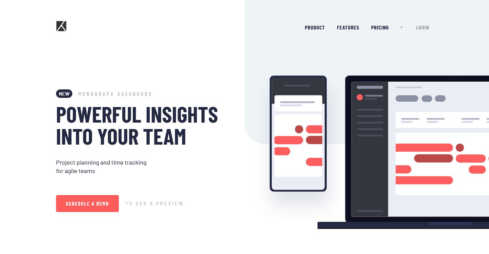
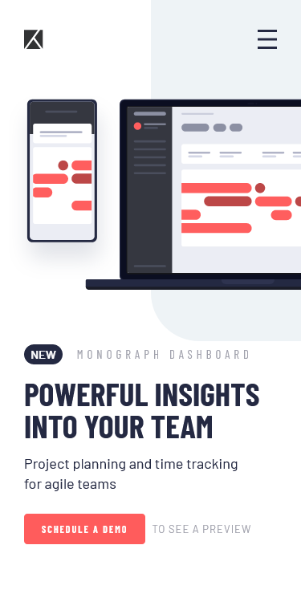
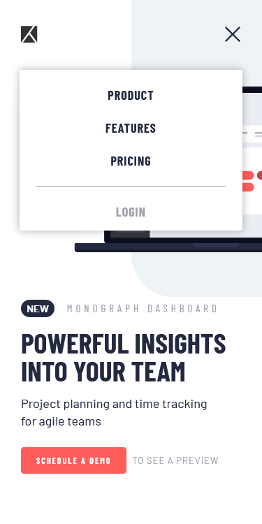

# Frontend Mentor - Project tracking intro component solution

This is a solution to the [Project tracking intro component challenge on Frontend Mentor](https://www.frontendmentor.io/challenges/project-tracking-intro-component-5d289097500fcb331a67d80e).

## Table of contents

---

- [Overview](#overview)
  - [The challenge](#the-challenge)
  - [Screenshot](#screenshot)
  - [Links](#links)
- [My process](#my-process)
  - [Built with](#built-with)
  - [What I learned](#what-i-learned)
- [Author](#author)

## Overview

---

### The challenge

Users should be able to:

- [x] View the optimal layout for the site depending on their device's screen size
- [x] See hover states for all interactive elements on the page
- [x] Create the background shape using code

### Screenshot

  
  

### Links

- Solution URL: [Solution](https://www.frontendmentor.io/solutions/project-tracking-intro-component-mu2lrsaRPo)
- Live Site URL: [Live](https://tracking-intro-component-green.vercel.app)

## My process

---

### Built with

- Flexbox
- Mobile-first workflow
- [React](https://reactjs.org/) - JS library
- [Styled Components](https://styled-components.com/) - For styles

### What I learned

**Hidding an absolute positioned element**

I went throught a lot of trouble before I found out that I should make sure to have the parent element be relative positioned when having a absolute positioned with `overflow: hidden`.

Even though I had the div container with `overflow: hidden`, the image inside it was still showing up complete, over the borders and making the page bigger.

## Author

---

- Frontend Mentor - [@yan-batista-1326](https://www.frontendmentor.io/profile/yan-batista-1326)
- LinkedIn - [@YanBatista](https://www.linkedin.com/in/yanbatista/)
